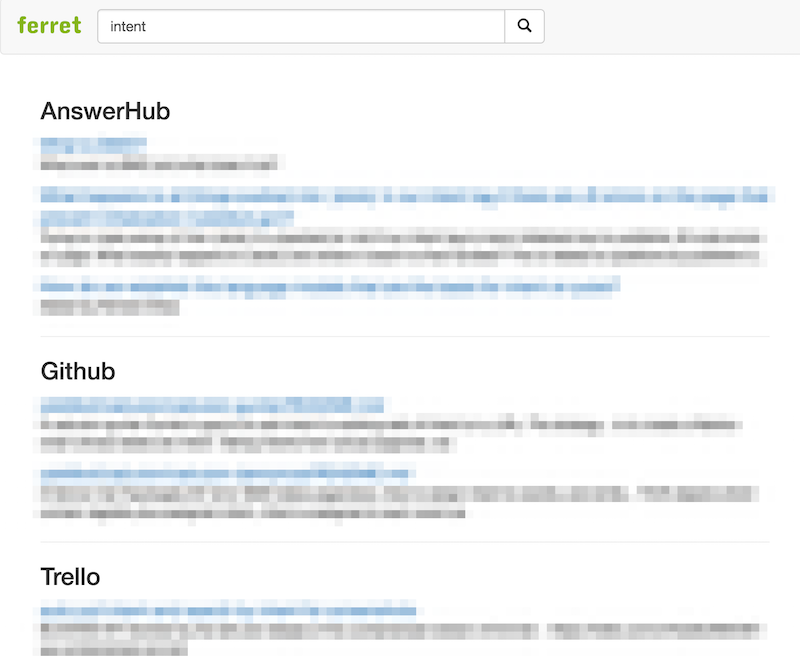

## Ferret

[![Build Status][travis-image]][travis-url] [![GoDoc][godoc-image]][godoc-url] [![Release][release-image]][release-url]

Ferret is a search engine that unifies search results from different resources
such as Github, Slack, Trello, AnswerHub and more. It can be used via
[CLI](#cli), [Web UI](#ui) or [REST API](#rest-api)

Distributed knowledge and avoiding context switching are very important for
efficiency. Ferret provides a unified search interface for retrieving and
accessing to information with minimal effort.


### Installation

| Mac | Linux | Win |
|:---:|:---:|:---:|
| [64bit][download-darwin-amd64-url] | [64bit][download-linux-amd64-url] | [64bit][download-windows-amd64-url] |

[See](#building-from-source) for building from source.


### Usage

Make sure Ferret is [configured](#configuration) properly before use it.

#### Help

```bash
ferret -h
```

#### CLI

```bash
# Search Github
# For more Github search syntax see https://developer.github.com/v3/search/
ferret search github intent
ferret search github intent+extension:md

# Search Slack
ferret search slack "meeting minutes"

# Search Trello
ferret search trello milestone

# Search AnswerHub
ferret search answerhub vpn

# Search Consul
ferret search consul influxdb

# Pagination
# Number of search result for per page is 10
ferret search trello milestone --page 2

# Timeout
ferret search trello milestone --timeout 5000ms

# Limit
ferret search trello epics --limit 100

# Opening search results
# Search for 'milestone' keyword on Trello and go to the second search result
ferret search trello milestone
ferret search trello milestone --goto 2
```

#### UI

```bash
ferret listen

# open http://localhost:3030/
```



#### REST API

```bash
# Listen for HTTP requests
ferret listen

# Search by REST API
curl 'http://localhost:3030/search?provider=answerhub&keyword=intent&page=1&timeout=5000ms'
```


### Configuration

#### Environment Variables for Providers

Each search provider needs set of environment variables for operating. You can 
define environment variables for one or more search provider.

```bash
# Github
export FERRET_GITHUB_URL=https://api.github.com/
# For a token see https://help.github.com/articles/creating-an-access-token-for-command-line-use/
export FERRET_GITHUB_TOKEN=
# It's optional for filtering specific Github user (i.e. yieldbot)
export FERRET_GITHUB_SEARCH_USER=

# Slack
# For a token see https://api.slack.com/docs/oauth-test-tokens
export FERRET_SLACK_TOKEN=

# Trello
# For a key see https://trello.com/app-key and visit (after update it);
# https://trello.com/1/authorize?key=REPLACEWITHYOURKEY&expiration=never&name=SinglePurposeToken&response_type=token&scope=read
export FERRET_TRELLO_KEY=
export FERRET_TRELLO_TOKEN=

# AnswerHub
# For enabling the REST API 
# see http://docs.answerhub.com/articles/1444/how-to-enable-and-grant-use-of-the-rest-api.html
export FERRET_ANSWERHUB_URL=https://answerhub.yourdomain.com
# For username and password information
# see 'My Preferences->Authentication Modes' page in your AnswerHub site
export FERRET_ANSWERHUB_USERNAME=
export FERRET_ANSWERHUB_PASSWORD=

# Consul
export FERRET_CONSUL_URL=http://consul.service.consul
```

#### Environment Variables for Global Configuration

```bash
# The command is used by `--goto` argument for opening links.
# Default is `open`
export FERRET_GOTO_CMD=open

# Default timeout for search command
# Default is `5000ms`
export FERRET_SEARCH_TIMEOUT=5000ms

# HTTP address for the UI and the REST API
# Default is :3030
export FERRET_LISTEN_ADDRESS=:3030
# A URL path prefix for the UI
export FERRET_LISTEN_PATHPREFIX=
# A comma separated list of providers
# Default value is automatically determined from the ENV variables
export FERRET_LISTEN_PROVIDERS=
```


### Building from source

```
go get -u -v github.com/yieldbot/ferret
cd $GOPATH/src/github.com/yieldbot/ferret
go generate ./assets
go build
```


### License

Licensed under The MIT License (MIT)  
For the full copyright and license information, please view the LICENSE.txt file.


[travis-url]: https://travis-ci.org/yieldbot/ferret
[travis-image]: https://travis-ci.org/yieldbot/ferret.svg?branch=master

[godoc-url]: https://godoc.org/github.com/yieldbot/ferret
[godoc-image]: https://godoc.org/github.com/yieldbot/ferret?status.svg

[release-url]: https://github.com/yieldbot/ferret/releases/latest
[release-image]: https://img.shields.io/badge/release-v2.0.1-blue.svg

[download-darwin-amd64-url]: https://github.com/yieldbot/ferret/releases/download/v2.0.1/ferret-darwin-amd64.zip
[download-linux-amd64-url]: https://github.com/yieldbot/ferret/releases/download/v2.0.1/ferret-linux-amd64.zip
[download-windows-amd64-url]: https://github.com/yieldbot/ferret/releases/download/v2.0.1/ferret-windows-amd64.zip
